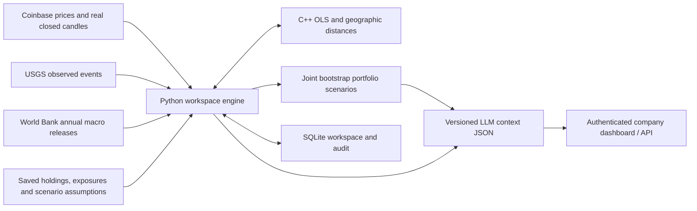

# GeoFolio — Company Workspace

GeoFolio helps a small treasury or research team follow a portfolio, see where it is exposed, and ask what might happen if a disruption hits one of those regions. It brings prices, geographic events and economic data into one place, then packages the results for an LLM to explain.

The numbers come from C++ and Python. The LLM receives the results, sources and assumptions; it does not calculate the hedge or invent the forecast.


The app starts with real data from Coinbase, USGS and the World Bank. You can edit holdings in the browser, share read-only access with a teammate, and save your settings between runs. None of the included feeds needs a paid API key.

This is a research tool. Its portfolio paths show possible outcomes under your assumptions, and their predictive accuracy has not been established. Live market coverage currently covers Coinbase USD crypto pairs. World Bank GDP figures are annual releases.

## Get it running

Install [Docker Desktop](https://www.docker.com/products/docker-desktop/) or Docker Engine with Compose, then:

```bash
git clone https://github.com/aerraj/geofolio-context.git
cd geofolio-context
docker compose up --build -d
docker compose exec geofolio geofolio init --data-dir /data
```

The final command displays your **administrator** and **viewer** access keys. Open **http://localhost:8000**, paste the administrator key, and sign in. The persistent Docker volume keeps your workspace between restarts. The service binds to localhost by default.

```bash
docker compose logs -f      # View provider/service status
docker compose down         # Stop; preserve the workspace volume
```

No local compiler or Python setup is needed with Docker. First build downloads dependencies and compiles the C++ module.

## Run directly on your computer

Requires **Python 3.11+** and a **C++17 compiler**. On macOS, install Xcode Command Line Tools; on Linux install `g++` and Python development headers; on Windows use Visual Studio Build Tools with Desktop development with C++.

After cloning the repository:

```bash
./scripts/start.sh           # macOS / Linux
```

Windows PowerShell:

```powershell
./scripts/start.ps1
```

These scripts create a local virtual environment, install the package, display private workspace access keys and start the live service. Manual equivalent:

```bash
python3 -m venv .venv
source .venv/bin/activate
pip install -e '.[dev]'
geofolio init
geofolio serve
```

Native Windows activation is `.venv\Scripts\Activate.ps1`. On later starts, activate the environment and run `geofolio serve`. To use an existing Python environment directly: `pip install "git+https://github.com/aerraj/geofolio-context.git@v0.2.0"`. The C++ compiler is still needed; Docker is the compiler-free installation route.

## Try it with your portfolio

1. **Sign in** using the administrator key from `geofolio init`.
2. **Portfolio settings:** enter your portfolio name, USD cash, Coinbase USD pairs and quantities. The example starts with 2 ETH and $10,000 cash, with BTC selected as a possible hedge; replace it with your own research holdings.
3. **Geographic exposures:** optionally add researched region coordinates, sector and exposure shares for each asset. These are user-supplied inputs, not inferred facts about a company or cryptocurrency.
4. **Overview:** inspect prices, provenance, sampling cutoff, hedge estimates and portfolio scenario bands. The app loads recent completed candles so you can see results soon after startup. If that request fails, it waits for enough live samples.
5. **Scenario assumptions:** select a real USGS event and supply an assumed impact in basis points, distance-decay scale, half-life and rationale. Remove prior assumptions before replacing them. Changes affect the next market sample.
6. **Export context:** download portable JSON or LLM messages. Give teammates the viewer key for read-only access.

The live adapter currently supports **up to ten Coinbase USD crypto pairs**, not equities or a universal brokerage feed. Custom equity/bond data can be supplied through manual ingestion. No exchange account is accessed and no orders are placed.

## What is included

| Feature | Implementation |
|---|---|
| Company access | Separate administrator/viewer keys; signed HttpOnly, SameSite session cookies; protected API and WebSocket reads; role-gated writes |
| Portfolio setup | Holdings, cash, hedge selection, country watchlist, geographic exposure forms and advanced JSON settings |
| Persistence | Local SQLite configuration, recent market/event records and bounded audit trail; optimistic configuration revision checks |
| Live observations | Coinbase ticker + closed-candle bootstrap; reconnect backoff; age checks and fixed-cadence alignment |
| Geographic monitor | USGS events on a locally bundled world map; exposure points and distance/time-decayed scenario shocks |
| Macro context | World Bank annual GDP and growth, with source, country, year and fetch time |
| Analytics | C++ stable OLS hedge slope and great-circle distances; Python joint block-bootstrap baseline/stressed paths |
| LLM protocol | Versioned JSON inputs/context, schemas, SHA-256 snapshot identifier, source evidence and model assumptions |
| Operations | Provider status, activity view, local exports, Docker Compose, startup scripts, tests and CI |

Access is designed for a small team. Administrators can change settings; viewers can read and export results. Keys are shared by role, so the activity log cannot identify individual people. A wider company rollout should use your organization’s identity and deployment controls. See [company deployment guidance](docs/DEPLOYMENT.md).

## Free data and update frequency

| Provider | Observed data | Fetch / sampling | Important boundary |
|---|---|---|---|
| [Coinbase Exchange](https://docs.cdp.coinbase.com/exchange/websocket-feed/overview) | USD crypto last trades and closed candles | Continuous ticker; 60-second portfolio samples by default; history on startup/config change | Not licensed global equity prices or a complete verified trade tape |
| [USGS](https://earthquake.usgs.gov/earthquakes/feed/v1.0/geojson.php) | M4.5+ earthquake locations and times | Poll every 60 seconds | Observed event impact defaults to zero; damage is not inferred from magnitude |
| [World Bank](https://datahelpdesk.worldbank.org/knowledgebase/articles/889392) | Latest available annual GDP and GDP growth | Fetch daily; retry failed fetches | Annual releases and revisions, **not live GDP**; not used automatically as a return signal |

Network availability and provider rate limits apply. Free access does not waive provider usage terms; see [sources and attribution](docs/SOURCES.md). Cached values and fetch errors are visible. No adapter silently substitutes synthetic data.

## Architecture



## How the calculations work

The hedge ratio is `Cov(portfolio return, hedge return) / Var(hedge return)`, fitted with an intercept on aligned observations. A positive ratio means the model would offset portfolio exposure by shorting the hedge; units are `ratio × portfolio_value / hedge_price`. The calculation has no position limits and leaves out borrowing, contract multipliers and trading costs. Check those separately before interpreting a ratio as a usable hedge.

Geographic shocks decay exponentially with distance and time and are weighted by supplied exposure shares. The regional economic stress index uses supplied weights; it is a **scenario proxy, not a GDP prediction**. Default crypto exposures are empty, so real event locations alone create no invented portfolio impact.

Portfolio paths jointly sample centered log returns in short blocks, preserving cross-asset dependence. The baseline has zero log drift; the assumed spatial shock is spread once across the horizon. Percentiles, loss probability, VaR and expected shortfall are model-conditional research outputs. The hedge is not applied to the plotted paths. No validated prediction accuracy or guaranteed growth is claimed. See [methodology](docs/METHODOLOGY.md).

## API and custom integration

Use an administrator or viewer key as `Authorization: Bearer <key>` for programmatic access. Browser sessions use cookies. `/docs` is available after sign-in.

| Endpoint | Purpose |
|---|---|
| `GET /health` | Anonymous process health only |
| `POST /auth/login`, `/auth/logout` | Session access |
| `GET /v1/workspace` | Configuration, role, feed status, macro releases and events |
| `PUT /v1/portfolio` | Admin update with `expected_revision`; resets analytic history |
| `GET /v1/audit` | Latest role-attributed actions |
| `GET /v1/context`, `/v1/llm/messages` | Context and provider-neutral LLM messages |
| `GET /v1/schema/{market,spatial,portfolio}` | Strict input JSON Schemas |
| `POST /v1/market` | Admin price ingestion, manual mode only |
| `POST /v1/events` | Admin event/scenario ingestion |
| `DELETE /v1/events/{event_id}` | Admin removal of a simulated assumption, effective next frame |
| `WS /v1/stream` | Authenticated latest-state delivery, one second |

Manual integrations and isolated synthetic demo:

```bash
geofolio serve --mode manual --portfolio examples/demo-portfolio.json --data-dir .geofolio-manual
geofolio serve --mode demo --data-dir .geofolio-demo
geofolio demo --output context.json
geofolio replay --portfolio examples/demo-portfolio.json your-records.jsonl
```

Use separate data directories for live, manual and demo workspaces. The saved SQLite configuration takes precedence over the startup portfolio file after initialization. Replay requires records in information-arrival order. Input examples and schemas are in [`examples/`](examples/) and [`docs/`](docs/PROTOCOL.md).

## Development and validation

```bash
pip install -e '.[dev]'
pytest -q
ruff check .
python -m pip wheel --no-deps . -w dist
```

Tests cover C++/NumPy numerical agreement, geographic distance, temporal integrity, stale/gapped quotes, correlated scenario sampling, overflow rollback, roles/session tampering, CSRF rejection, persistence, revision conflicts, candle alignment and macro parsing. GitHub CI builds/tests on Linux, macOS and Windows, plus a Docker smoke test. Live network smoke tests are separate from deterministic CI tests.

C++ is compiled with pybind11; there is no silent Python fallback. Locally tested Python dependencies are recorded in `requirements-tested.txt`. Backtests and calibrated macro transmission models remain future research work. MIT license applies to this code, not third-party data.
